<table width=100% border=>
<tr><td colspan=2><h1>EXERCISE 02 - IoT : Sending Data with REST via Internet of Things Gateway Cloud</h1></td></tr>
<tr><td><h3>SAP Partner Workshop</h3></td><td><h1> &nbsp;60 mins</h1></td></tr>
</table>

## Description
This document provides the hands-on session on SAP Cloud Platform Internet of Things 4.0 for the scenario based on Internet of Things Gateway Cloud using the REST protocol.

* Creating Data Model
* Device on boarding with Gateway Cloud using REST protocol.
* Sending data with curl
* Consume Data via IoT Services Cockpit

>NOTE: Use Google Chrome browser.

## Target group

* Developers
* People interested in SAP Leonardo and Machine Learning

## Goal

The goal of this exercise is to create a new data model in the IoT Service cockpit, to onboard a new device and a new sensor with SAP Gateway Cloud using REST protocol, to send data with Paho REST Client and finally to consume them via IoT Services Cockpit and APIs

## Prerequisites

Here below are prerequisites for this exercise.

* An SAP IoT Service system. It will be provided by your instructor
* A remote desktop connection app to access the remote system

## Steps

1. [Creating device data model (Same as Exercise_01)](#creating-device-data-model)
1. [Device and sensor onboarding](#device-and-sensor-onboarding)
1. [Sending messages via MQTT using Paho client](#mqtt-Paho)
1. [Consuming and viewing sensor data](#consuming-sensor-data)
1. [Working with commands](#working-with-commands)

###  Creating device data model
Centralized Device data model provides the schema of device related configurations including the data fields that will be exchanged. Default template is provided and can be downloaded from the SAP Cloud Platform Internet of Things services cockpit. If you have any deviations or additions, a new sensor type can be added to the default central data model. In the below steps, we will extend this default central device data model with the new fields "Soil pH and Moisture" that we will be getting from the device simulator. In this section, you will create few capabilities (measures and commands). A capability can be reused since it can be assigned to multiple sensor types: each capability can have one or many properties.

1.	Open the browser and navigate to the IoT Service Cockpit URL and log on with the tenant user credentials, provided by the instructor  
	

1.	Use the main menu to navigate to the Device Management -> Capabilities section and click on the "+" sign to add new capabilities like Soil pH and Soil Moisture  
	

1. In the **General information** section enter **Name** as **Soil_pH** and in the **Properties** section enter the following information and click on **Create**. Ensure the capability is created successfully

	| Parameter | Value    |
	| --------- | -------- |
	| Name | Soil \_pH     |
	| Data Type | float    |
	| Unit Of Measure | pH |
	
	

1.	Once again navigate to **Capabilities** section and click on the "**+**" sign to add the second capability **Soil_Moisture**  
	   

1. In the **General information** section enter **Name** as **Soil_Moisture** and in the **Properties** section enter the following information and click on **Create**. Ensure the capability is created successfully

	| Parameter | Value      |
	| --------- | ---------- |
	| Name | Soil \_Moisture |
	| Data Type | float      |
	| Unit Of Measure | %    |
	
	

1.	Once again navigate to **Capabilities** section and click on the "**+**" sign to add the command Water_Alert  

1. In the **General information** section enter **Name** as **Water_Alert** and in the **Properties** section enter the following information and click on **Create**. Ensure the capability is created successfully

	| Parameter | Value   |
	| --------- | ------- |
	| Name | Water\_alert |
	| Data Type | string  |
	
	

1. Navigate to **Device Management -> Sensor Types** and click on the "**+**" sign to add a sensor type for the Soil Sensor Type  

1. In the **General information** section enter Name as Soil_SensorTypeXX, where XX is your workstation ID and in the **Capabilities** section enter and add the earlier created capabilities

	| Capability | Type       |
	| --------- | ----------- |
	| Soil_pH | measure       |
	| Soil_Moisture | measure |
	| Water_Alert | command   |
	
	
	
	
	Click on **Create**. Ensure the Sensor Type is created successfully

1. Congratulations! You have successfully created a new data model.

###  Device and sensor onboarding
Each device exchange data with a specific protocol (for example: REST in this exercise). We need to create that corresponds to a physical device. In the following section, it is described how to create a device for the REST network. Also we onboard all the sensors and Actuators for the Device.

1.	Use the main menu to navigate to the **Device Management -> Devices** section and click on the "**+**" sign to start the device creation process

	>NOTE: As an alternative, devices and sensors can also be created via APIs. In this exercises, we will create it via UI cockpit  

	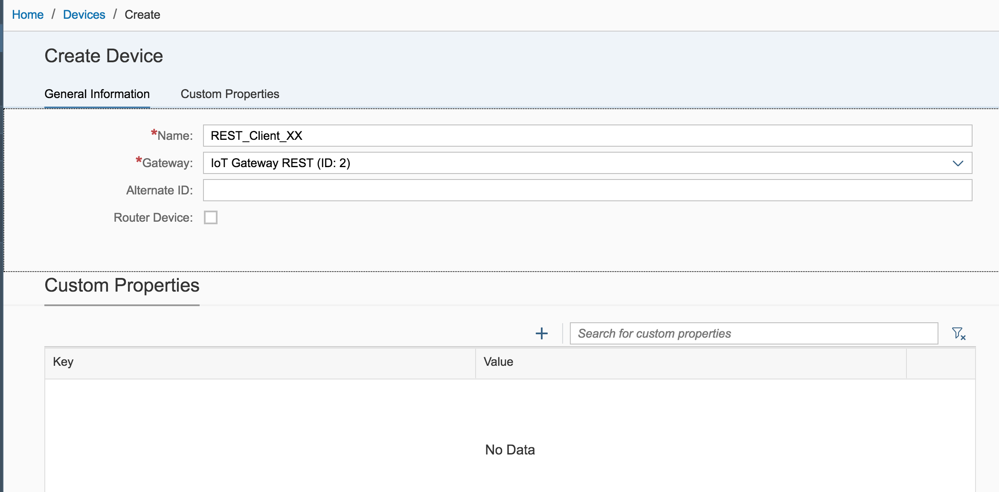

1.	In the **General Information** section, enter the following information and click on **Create**

	| Parameter | Value |
	| --------- |----- |
	| Name | REST\_Client\_XX |
	| Gateway |REST Network |
	| Alternate ID | \<leave it blank\> |

	>NOTE: Ignore the Alternate ID as it's optional and is filled on Create. This would be required at later steps to be provided in REST Client as well    

	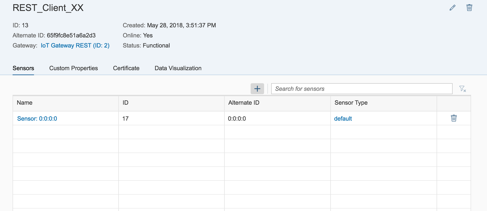

1.	In the new device, Sensor tab click on the "**+**" sign to create a new sensor  
	

1.	In the General Information section, enter a name such as "**Soil_Sensor_REST", select Sensor Type you have created earlier (i.e. Soil\_SensorTypeXX, where **XX** must be replaced with your workstation ID) and ignore the Alternate ID as it's optional. This Soil\_Sensor automatically provides Soil\_pH, Soil\_Moisture and it also supports an alert: these are the capabilities we have previously defined. Once done click on **Add**  
	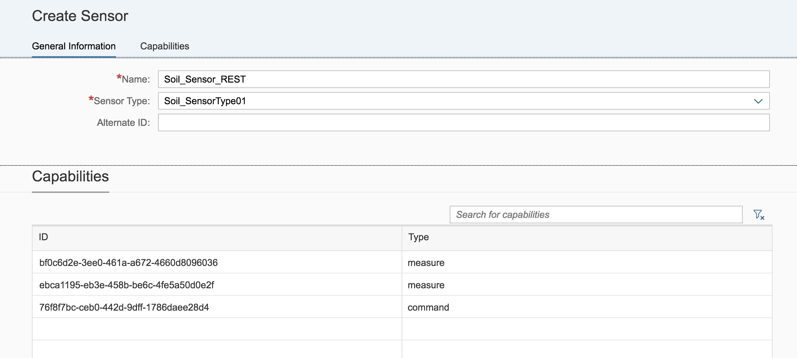

1.	The new sensor is created and you should be able to see the **Soil_Sensor_REST under the **Sensors** tab of the REST\_Client\_XX device onboarded earlier  
	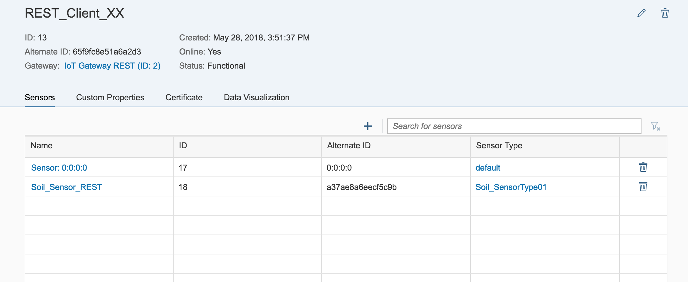

1. Be sure that your REST Client device is selected, choose the **Certificate** tab and click on **Generate Certificate**  
	

1. Choose the Certificate Type **pem** and click **Generate**  
	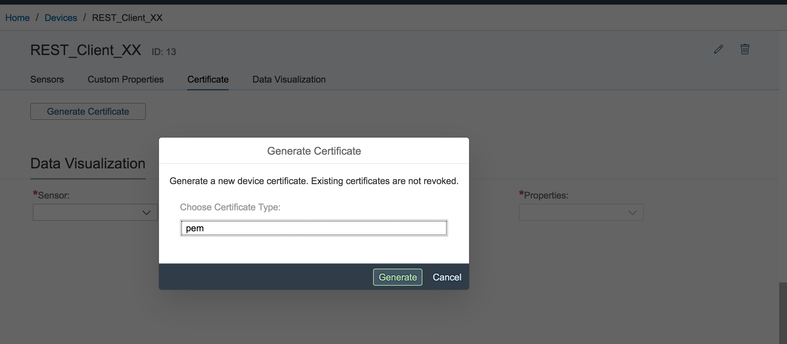

1. This will trigger a popup window providing you with a secret key which you must copy and save in notepad. Then click **OK**  
	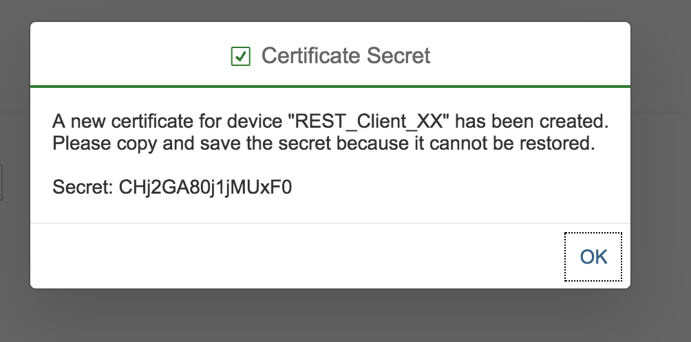

1. You can also see the downloaded certificate *REST\_Client\_XX-device\_certificate.pem* in the Chrome browser status bar. Click on the small down arrow and choose **Show in folder**  
	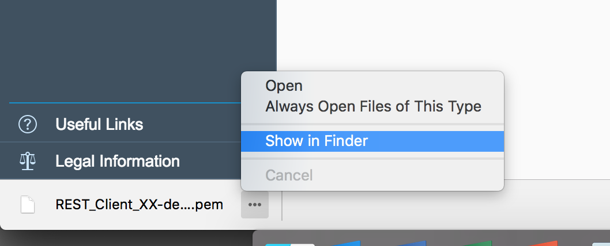

1. This will make you to understand where the certificate is located. Please keep in mind this location since it will be used in the next section  
	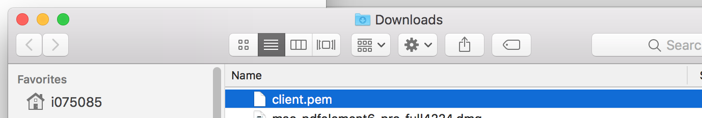

1. Congratulations! You have successfully onboarded a new device and a new sensor.

###  Sending messages via REST using curl
In this step, we will send the data from Device Simulator that supports REST protocol. We have already on-boarded this simulator device during previous steps. Once we send the data, it would be received by Internet of Things Gateway Cloud and would be visible in the IoT services cockpit and via APIs.

1.	Open the terminal (macOS) or command line tool CMD (Windows) and change the directory to the path of the extracted REST device certificate.  
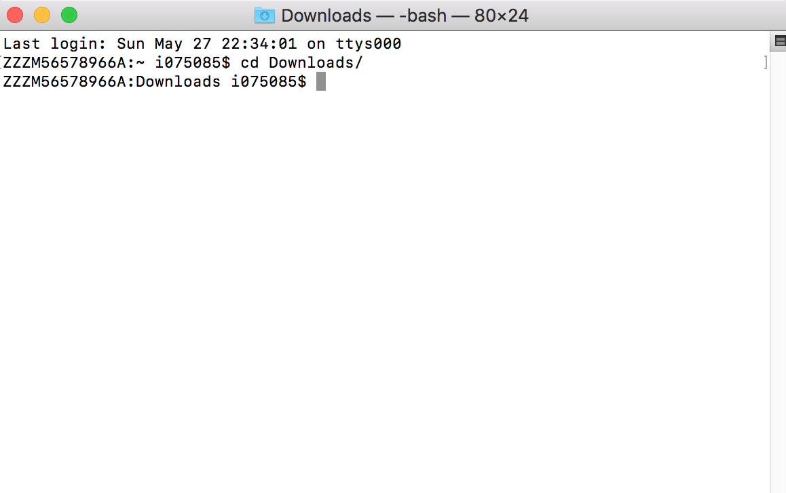

1. Check the version of curl.  
	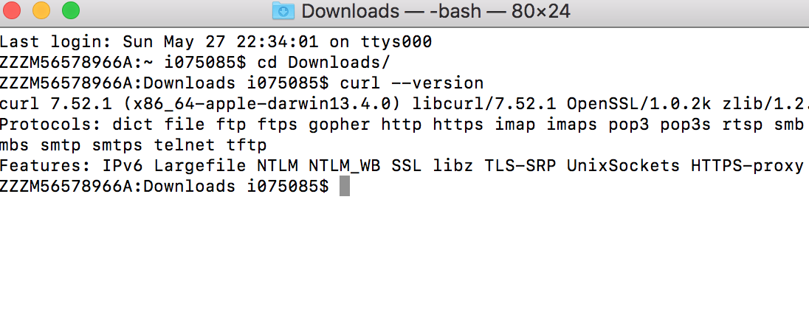
	Remember it is with SecureTransport or without.
	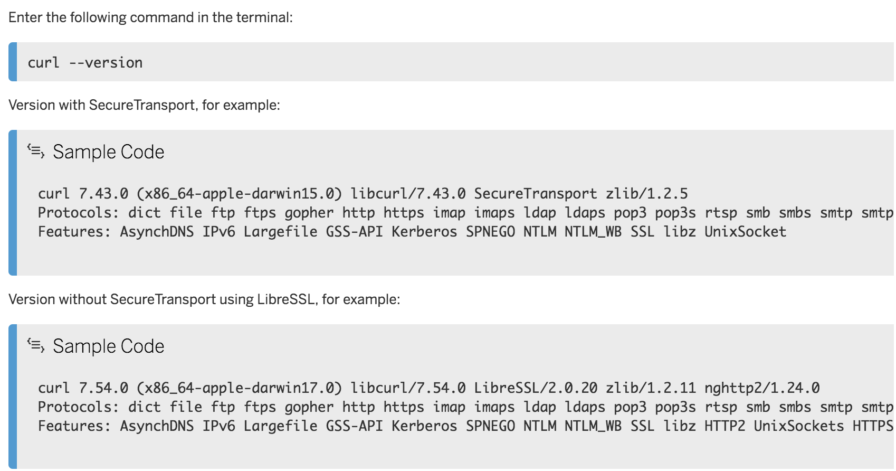

1.	Click on the "**+**" sign to create a new connection  
	

1.	Send data using curl to the device.
	curl -v -k -E client.pem:<SECRET_KEY> -H "Content-Type:application/json" -d "<ENCODED_JSON_MESSAGE>" <REST_ENDPOINT>
	
	Sample Code:
curl -v -k -E client.pem:jJ3fF7dD0rR2rR3wW0eE2tT -H "Content-Type:application/json" -d "{ \"capabilityAlternateId\": \"1\", \"sensorAlternateId\": \"0:0:0:0\", \"measures\": [{\"Temperature\": \"25\"}] }" https://demo.eu10.cp.iot.sap/iot/gateway/rest/measures/11223344

1.	Check the response code in the terminal, it should contains "HTTP/1.1 200 OK". 
	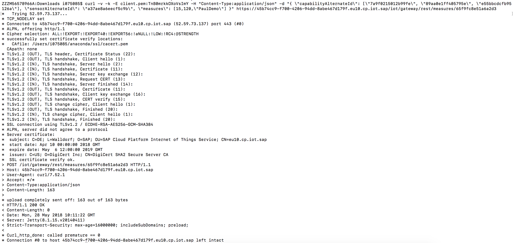

	Sample Code:
1. Congratulations! You have successfully sent messages via REST using curl.

###  Consuming and viewing sensor data
This section explains various ways we can consume and visualize the measurements which are sent to IoT Cloud Gateway.

1. Select your **Paho Client** device in the cockpit, go to the **Data Visualization** tab, specify your **Sensor** - Soil_Sensor, a **capability** - like Soil_pH and the **property** you want to analyze and click on the **Refresh** button. You should get a chart with all the data  
	

1.	Feel free to do the same for the **Soil_Moisture** capability  
	

1. Congratulations! You have successfully consumed and analyzed sensor data.

## Summary
You have completed the exercise!

You are now able to:

* create a new Data Model
* onboard Devices with Gateway Cloud using REST protocol
* send Data with curl
* consume Data via IoT Services Cockpit

Please proceed with next exercise.
