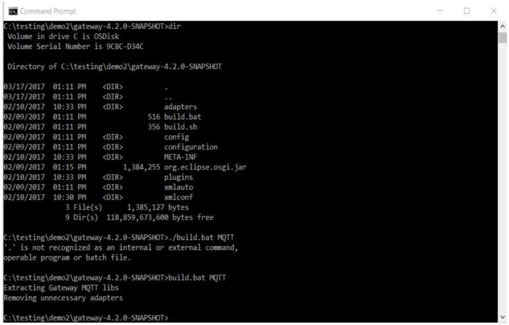
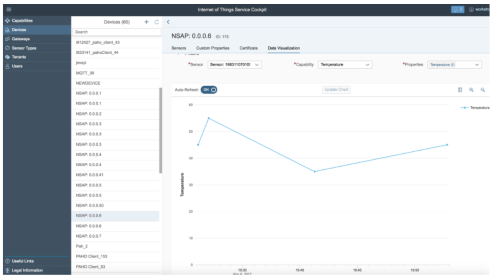

<table width=100% border=>
<tr><td colspan=2><h1>EXERCISE 03 - IoT : Gateway Edge - MQTT</h1></td></tr>
<tr><td><h3>SAP Partner Workshop</h3></td><td><h1> &nbsp;90 mins</h1></td></tr>
</table>

## Description
This document provides you with the exercises for the hands-on session on SAP Cloud Platform, Internet of Things. This scenario will help you to go through the following activities:

* IOT Gateway Edge provisioning with MQTT protocol
* Device on boarding with Gateway Cloud using MQTT protocol.
* Sending Data with MQTT Simulator Client
* Consume Data via IoT Services Cockpit

>NOTE: Use Google Chrome browser.

## Target group

* Developers
* People interested in SAP Leonardo and Machine Learning

## Prerequisites

Here below are prerequisites for this exercise.

* An SAP IoT Service system. It will be provided by your instructor
* A remote desktop connection app to access the remote system
* IOT Gateway Edge Build is available in a shared location provided by the instructor

## Steps

1. [Introduction](#introduction)
1. [Setup of IOT gateway Edge for MQTT Protocol](#creating-device-data-model)
1. [Device onboarding](#device-onboarding)
1. [Sending messages via MQTT using MQTT simulator client](#mqtt-MQTT simulator)
1. [Consuming and viewing sensor data](#consuming-sensor-data)

###  Introduction
The SAP Cloud Platform Internet of Things Service enables customers and partners to develop, customize, and operate IoT business applications in the cloud. IoT Services provides Lifecycle management at scale for IoT devices from onboarding to decommissioning. It also provides a way to securely connect to remote devices over a broad variety of IoT protocols. It provides gateway Edge which provides on-premise IoT edge processing and also gateway cloud which does centralized cloud based processing. The **IoT cockpit** is the user interface of the solution and provides access to various functions. It is the main interface for users to interact with the Internet of Things core service. It can be used for creating users and tenants, for creating device data models, for device onboarding and for adding new networks. It can also be used to deploy interceptors, retrieve network logs, visualize the data which are being ingested via IoT devices/sensors.  

###  Setup of IOT gateway Edge for MQTT Protocol

1.	Unzip this Edge Build Archive to a destination folder of your choice. 
	

1.	Open terminal, change to the destination folder and execute build executable from the destination folder location.
	Linux: ./build.sh MQTT 
	WIndows: build.bat MQTT
	
	
1.	Script should run successfully and you should see the results as shown in the picture 
1.	A new folder named config is created which includes the file config_gateway_mqtt.xml. 
1.	Log on to the Internet of Things service cockpit with the Tenant owner credentials. i.e. User, password
1.	Go to the right corner of the cockpit, click the user, and download the certification 
1.	The system starts to download a ZIP file which is named certificates.zip and contains the certificates. 
1.	Delete certificates folder all content in config directory. 
1.	Extract certificates.zip Archive content to the certificates folder in the config folder of the Internet of Things Gateway Edge 
1.	Open the password.properties file in the certificates folder with a text editor. 
1.	Provide user password details 
1.	Save the password.properties file. 
1.	Open config_gateway_mqtt.xml with a text editor 
1.	Replace 127.0.0.1 with <HOST_NAME> for the brokerName and coreBundles xml tags. 
1.	Open the terminal (macOS) or command line tool CMD (Windows) and change the directory to the path of the extracted ZIP file Internet of Things Gateway Edge. 
1.	Launch gateway.bat in the extracted folder. 
1.	Edge gateway onboarding will start
1.	Navigate to Main Menu Gateways option. 
1.	You can see new MQTT Network created with the address provided in the gatewayAddress of gateway configuration
1.	Also, you can see that Gateway Edge is successfully connected and online. 
1.	Launch the MQTT simulator Client. 
1.	In Connection 1 page, Navigate to MQTT Tab Under Connection options，Please provide server URI as following: tcp://localhost:61618
1.	Please Click on Connect Button. 
1.	You must see the status as connected
1.	This demonstrates that the Gateway Edge MQTT Broker is Active and started. 

###  Device Onboarding
Each device exchange data with a specific protocol (for example: MQTT in this exercise). Each device corresponds to 1 unique physical device. We need to create device that corresponds to a physical device. In the following section, it is described how to create a device for the MQTT network.

1.	Navigate to Main Menu Gateways option and expand MQTT Network. Click on Add item in the options list.
1.	Create device for gateway (please make sure you are using the MQTT gateway of your edge) “Create Device”
1.	Provide all the details for the device and add create sensor for the device you have created.

###  Sending messages via MQTT using MQTT simulator client
In this step, we will send the data from Device Simulator that supports MQTT protocol. We have already on-boarded this simulator device during previous steps. Once we send the data, it would be received by Internet of Things Gateway Edge, which will send the data to IOT Core Services and data would be visible in the IoT services cockpit and vis APIs.

1.	Launch the MQTT MQTT simulator Client. You would have already installed it as part of pre- requisite document. 

1.	Navigate to File Menu   New Connection option. This will open Connection1 Tab.
1.	Configure Connection1 MQTT Tab with below details:
	Please take the hostname from the URL provided by your instructor to access IoT services cockpit.
	ServerURI: tcp://localhost:61618
	clientID: do not give anything 
1.	Click on Connect, status should turn to connected as shown in picture 

Optional:
1.	Another way to onboard the device is via the MQTT message automatically via MQTT simulator client
	Client ID is the Device alternative ID
	The payload { "capabilityAlternateId": "1", "sensorAlternateId": "198311070105","measure s": [["55"]] } will create a sensor alternative ID with “198311070105” with default sensor type 0 and capability alternative ID 1.
	he second message publication is to send the measurement only
	You can also find the information in your edge gateway log
1.	Open IoT Cockpit. 
1.	Navigate to Main Menu Device option and you can see a device is created automatically. 

Publish Messages with MQTT:
1.	Navigate to Connection1 MQTT tab, Modify the Message options under Publication section as follows:
Change the temperature values randomly in the “values” entity of MQTT JSON payload. 
	E.g.  { "capabilityAlternateId": "1",
		 "sensorAlternateId":
		 "198311070105","measures"
		 : [["35"]] }
1.	Click on Publish with several such different measurement data points. 

###  Consuming and viewing sensor data
This section explains various ways we can consume and visualize the measurements which are sent to IoT Cloud Gateway.

1. Select your **MQTT simulator Client** device in the cockpit, go to the **Data Visualization** tab, specify your **Sensor** - Soil_Sensor, a **capability** - like Soil_pH and the **property** you want to analyze and click on the **Refresh** button. You should get a chart with all the data  
	

1.	Feel free to do the same for the **Soil_Moisture** capability  
	

1. Congratulations! You have successfully consumed and analyzed sensor data.

## Summary
You have completed the exercise!

You are now able to:

* create a new Data Model
* onboard Devices with Gateway Edge using MQTT protocol
* send Data with MQTT Simulator Client
* consume Data via IoT Services Cockpit
