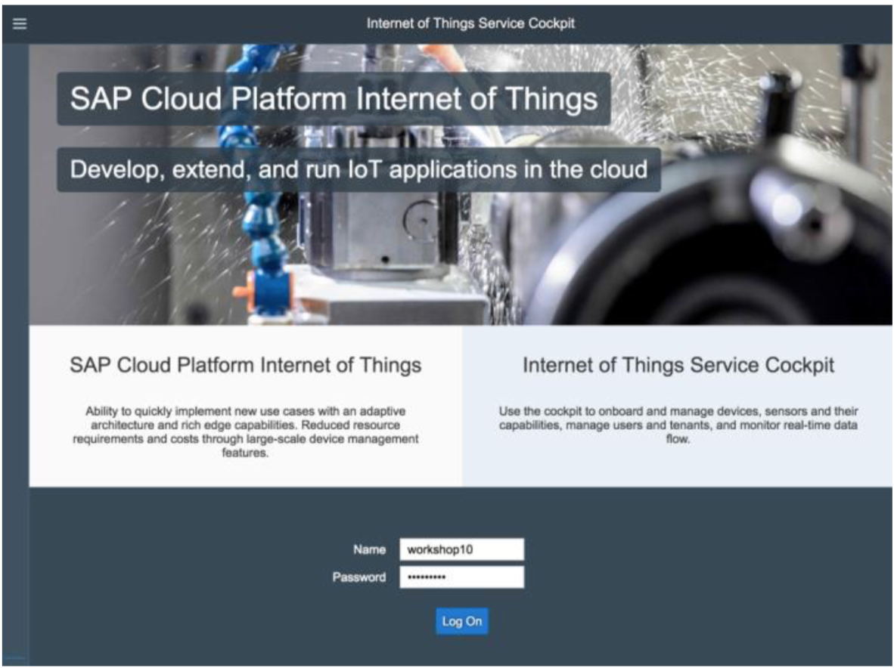

<table width=100% border=>
<tr><td colspan=2><h1>EXERCISE 01 - IoT : Gateway Edge - MQTT</h1></td></tr>
<tr><td><h3>SAP Partner Workshop</h3></td><td><h1> &nbsp;90 mins</h1></td></tr>
</table>


## Description
This document provides you with the exercises for the hands-on session on SAP Cloud Platform, Internet of Things. This scenario will help you to go through the following activities:

* IOT Gateway Edge provisioning with MQTT protocol
* Device on boarding with Gateway Cloud using MQTT protocol.
* Sending Data with PAHO MQTT Client
* Consume Data via IoT Services Cockpit

>NOTE: Use Google Chrome browser.


## Target group

* Developers
* People interested in SAP Leonardo and Machine Learning


## Prerequisites

Here below are prerequisites for this exercise.

* An SAP IoT Service system. It will be provided by your instructor
* A remote desktop connection app to access the remote system
* IOT Gateway Edge Build is available in a shared location provided by the instructor


## Steps

1. [Introduction](#introduction)
1. [Setup of IOT gateway Edge for MQTT Protocol](#creating-device-data-model)
1. [Device and sensor onboarding](#device-and-sensor-onboarding)
1. [Sending messages via MQTT using Paho client](#mqtt-Paho)
1. [Consuming and viewing sensor data](#consuming-sensor-data)


### <a name="introduction"></a> Introduction
The SAP Cloud Platform Internet of Things Service enables customers and partners to develop, customize, and operate IoT business applications in the cloud. IoT Services provides Lifecycle management at scale for IoT devices from onboarding to decommissioning. It also provides a way to securely connect to remote devices over a broad variety of IoT protocols. It provides gateway Edge which provides on-premise IoT edge processing and also gateway cloud which does centralized cloud based processing. The **IoT cockpit** is the user interface of the solution and provides access to various functions. It is the main interface for users to interact with the Internet of Things core service. It can be used for creating users and tenants, for creating device data models, for device onboarding and for adding new networks. It can also be used to deploy interceptors, retrieve network logs, visualize the data which are being ingested via IoT devices/sensors.  
	


### <a name="creating-device-data-model"></a> Setup of IOT gateway Edge for MQTT Protocol


1.	Unzip this Edge Build Archive to a destination folder of your choice. 
	

1.	Open terminal, change to the destination folder and execute build executable from the destination folder location.
	Linux: ./build.sh MQTT 
	WIndows: build.bat MQTT
	
	
1.	Script should run successfully and you should see the results as shown in the picture 
1.	A new folder named config is created which includes the file config_gateway_mqtt.xml. 
1.	Log on to the Internet of Things service cockpit with the Tenant owner credentials. i.e. User, password
1.	Go to the right corner of the cockpit, click the user, and download the certification 
1.	The system starts to download a ZIP file which is named certificates.zip and contains the certificates. 
1.	Delete certificates folder all content in config directory. 
1.	Extract certificates.zip Archive content to the certificates folder in the config folder of the Internet of Things Gateway Edge 
1.	Open the password.properties file in the certificates folder with a text editor. 
1.	Provide user password details 
1.	Save the password.properties file. 
1.	Open config_gateway_mqtt.xml with a text editor 
1.	Replace 127.0.0.1 with <HOST_NAME> for the brokerName and coreBundles xml tags. 
1.	Open the terminal (macOS) or command line tool CMD (Windows) and change the directory to the path of the extracted ZIP file Internet of Things Gateway Edge. 
1.	Launch gateway.bat in the extracted folder. 
1.	Edge gateway onboarding will start
1.	Navigate to Main Menu Gateways option. 
1.	You can see new MQTT Network created with the address provided in the gatewayAddress of gateway configuration
1.	Also, you can see that Gateway Edge is successfully connected and online. 
1.	Launch the PAHO Client. 
1.	In Connection 1 page, Navigate to MQTT Tab Under Connection options，Please provide server URI as following: tcp://localhost:61618
1.	Please Click on Connect Button. 
1.	You must see the status as connected
1.	This demonstrates that the Gateway Edge MQTT Broker is Active and started. 


### <a name="mqtt-Paho"></a> Sending messages via MQTT using Paho client
In this step, we will send the data from Device Simulator that supports MQTT protocol. We have already on-boarded this simulator device during previous steps. Once we send the data, it would be received by Internet of Things Gateway Cloud and would be visible in the IoT services cockpit and via APIs.

1.	Launch the **MQTT Paho Client**, it should be located under the *C:\Student\PahoClient* folder  


1. Click on **Run** in case you get the security warning  
	

1.	Click on the "**+**" sign to create a new connection  
	

1.	Configure the **MQTT** tab of **connection1** with this information
	
	| Parameter | Value |
	| --------- | ----- |
	| Server URI | `ssl://<host_name>:8883` where **\<host\_name\>** is the host part in the cockpit  URL |
	| Client ID | The AlternateID of the Device Paho\_Client\_XX |

	

1.	Click on the **OPTIONS**, select **Enable SSL** and click on the first **Browse...** button to specify the Key Store Location  
	

1.	Change the file extension search criteria to \*.p12 and browse for the *Paho\_Client\_XX-device\_certificate.p12* you have downloaded from IoT Services Cockpit  
	

1. As Key Store Password, specify the client secret you have copied in your notepad. Then click on the second **Browse...** button to locate the Trust Store repository  
	

1. Change the file extension search criteria from \*.jks to \*.\* and go to the folder *\<JRE\_Installation\_Folder\>\jre\lib\security*, in your case it should be *C:\Program Files\Java\jre1.8.0_161\lib\security*. Once there, select the file *cacerts* and click **Open**  
	

1. As Trust Store password, simply use the text "**changeit**"  
	

1.	Go to the **MQTT** tab and click on **Connect**  
	

1.	Status should turn to **Connected** as shown in the picture  
	

1.	In the **Publish** section, enter the topic `measures/<alternate_id>` replacing `alternate_id` with the **Alternate ID** of the device  
	

1. Use the default settings for **QOS**

1. Copy the following JSON script and paste it in a text editor

	```json
	{
	"capabilityAlternateId":[
		"<<< Soil_pH Capability Alternate ID >>>",
		"<<< Soil_Moisture Capability Alternate ID >>>",
		"<<< Water_Alert Capability Alternate ID >>>"
		],
	"measures":[7,35,"demo"],
	"sensorAlternateId":"<<< Sensor Alternate ID >>>"
	}
	```

1. Replace the **<<< Sensor Alternate ID >>>** with the **Alternate ID** you can read by going on your **Soil\_Sensor** in your **Paho\_Client\_XX** device  
	

1. Then go to **Sensor Types -> Soil_SensorTypeXX**  
	

1. Replace the **<<< Soil_pH Alternate ID >>>** with the Alternate ID of the Soil_pH capability  
	

1. Repeat the previous 2 steps for the other capabilities (Soil_Moisture and Water_Alert). At the end copy the JSON script you have created and paste it in the Message text area of your Paho Client. Then click **Publish**  
	

1. A new line is added to the history on the right  
	

1. Repeat this step several times, each time by changing the values for Soil\_pH and Soil\_Moisture in the  measures section of the JSON file  
	

1. At the end you should have a history with several different pubblications  
	

1. Congratulations! You have successfully sent messages via MQTT using the Paho Client.


### <a name="consuming-sensor-data"></a> Consuming and viewing sensor data
This section explains various ways we can consume and visualize the measurements which are sent to IoT Cloud Gateway.

1. Select your **Paho Client** device in the cockpit, go to the **Data Visualization** tab, specify your **Sensor** - Soil_Sensor, a **capability** - like Soil_pH and the **property** you want to analyze and click on the **Refresh** button. You should get a chart with all the data  
	

1.	Feel free to do the same for the **Soil_Moisture** capability  
	

1. Congratulations! You have successfully consumed and analyzed sensor data.

## Summary
You have completed the exercise!

You are now able to:

* create a new Data Model
* onboard Devices with Gateway Cloud using MQTT protocol
* send Data with Paho MQTT Client
* consume Data via IoT Services Cockpit


Please proceed with next exercise.
